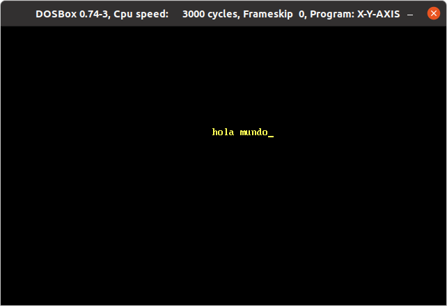

# Assembly 8086 Collision In Axes  


## About The Project

Program that detects collisions in the x and y axes to generate the bounce of a text string.

### Built with

* DOSBox
* VSC

## Getting Started

### Installing

1. Install DOSBox
    ```sh
    sudo apt-get install dosbox
    ```

2. Clone the repo
    ```sh
    git clone https://github.com/oscarbmo01/assembly8086-xy-axes-collision.git

## Usage

1. Open DOSBox  
2. Mount drice C and point to the path of the x-y-axis.asm file  
    ```sh
    mount c: /home/...
    ```
3. Compile the .asm file to .obj
    ```sh
    TASM.EXE x-y-axis.asm
    ```
4. Create the .exe file from the .obj
    ```sh
    TLINK.EXE X-Y-AXIS.OBJ
    ```
5. Run the X-Y-AXIS.EXE file
    ```sh
    ./X-Y-AXIS.EXE
    ```


## Licence

Distributed under the MIT License. See LICENSE for more information.